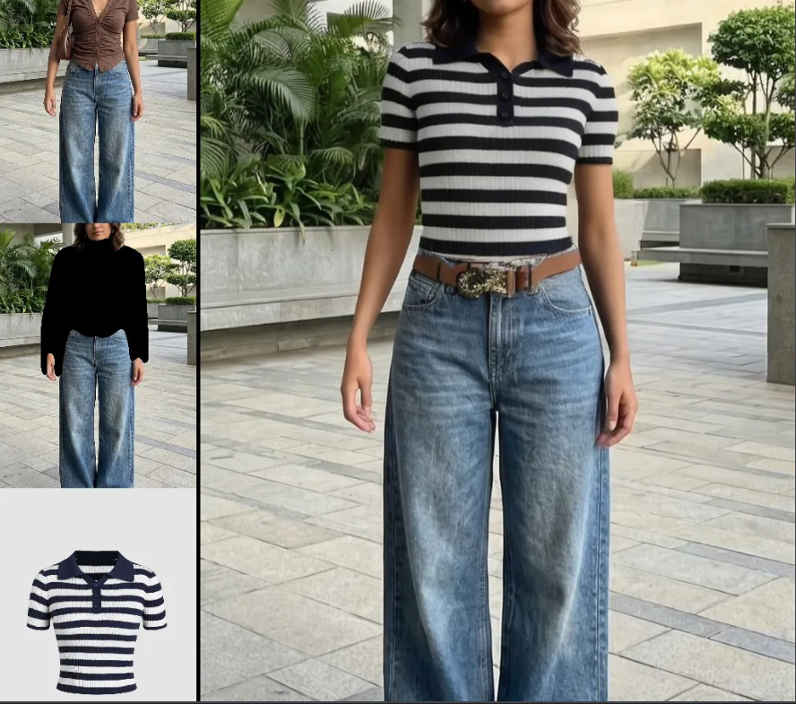

# Pin2Wear — Virtual Try-On

A web app that lets users browse outfits and see how they'd look wearing them, powered by **CatVTON**, an open-source diffusion-based virtual try-on model, served via Hugging Face Spaces.

## Demo



**Live app:** https://pin2wearr.netlify.app

---


## How It Works

1. **Browse** — the user scrolls a Pinterest-style feed of garments, filterable by category, rendered dynamically from `pins.json`.
2. **Select** — clicking "Try on" on any garment carries that item's image/label/category into the try-on page via URL params.
3. **Upload** — the user uploads a photo of themselves (full body or upper body).
4. **Generate** — on clicking "Try This On," the frontend sends both images to the backend API.
5. **Inference** — the backend relays the images to the CatVTON model running on Hugging Face's GPU infrastructure, which generates a new image of the person wearing the selected garment.
6. **Result** — the generated image is returned as base64-encoded data and rendered directly in the "Your Look" panel. Users can save results to a personal moodboard (stored in browser `localStorage`).

---

## Architecture

```
┌─────────────────┐         ┌──────────────────┐         ┌────────────────────┐
│   Frontend       │  HTTP   │   Backend         │  API    │  CatVTON             │
│   (Netlify)      │ ──────> │   Flask (Render)  │ ──────> │  Hugging Face Space  │
│                  │ <────── │                   │ <────── │  (GPU inference)     │
│  HTML / CSS / JS │  JSON   │  gradio_client     │  image  │  Diffusion model     │
└─────────────────┘         └──────────────────┘         └────────────────────┘
```

- **Frontend** is fully static — no server-side rendering. Deployed on Netlify.
- **Backend** is a lightweight Flask relay — it does *not* run the AI model itself. It preprocesses images (format conversion, RGBA→RGB handling) and forwards requests to CatVTON via the `gradio_client` Python library. Deployed on Render.
- **CatVTON** runs entirely on Hugging Face's own GPU-backed infrastructure (the public `zhengchong/CatVTON` Space). This is what makes the backend cheap to host — it needs no GPU of its own.

---

## The Model — CatVTON

[CatVTON](https://arxiv.org/abs/2407.15886) ("Concatenation Is All You Need for Virtual Try-On with Diffusion Models") is an open-source diffusion model for virtual try-on, designed to be far lighter than earlier approaches.

### The old approach it improves on
Earlier diffusion-based try-on systems typically used a **Dual UNet** design — duplicating the entire denoising network as a separate "ReferenceNet" just to process the garment image, often alongside additional image encoders like CLIP or DINOv2. This produced good fidelity but was computationally heavy, both to train and to run.

### CatVTON's approach
Instead of a second network, CatVTON simply **concatenates the person image and garment image along spatial dimensions** and feeds that combined input into a **single** denoising UNet. The intuition: a pretrained latent diffusion model already has strong general image priors, so rather than building new encoder modules, it's more efficient to fine-tune only the parameters that govern how garment and person features interact within the existing shared latent space.

Key technical facts:
- **~899 million total parameters**, but only **~49.57 million are trainable** — the rest leverages frozen, pretrained weights.
- **No text encoder, no cross-attention layers, no ReferenceNet** — these are all removed compared to prior architectures.
- **No pose estimation or human parsing needed as input** — unlike many older systems, CatVTON only requires the person photo and the garment photo; it infers fit and pose internally.
- This reduces memory requirements during inference by over 49% compared to Dual-UNet approaches, while still achieving competitive (often better) results on standard benchmarks like VITON-HD.

### How this app calls it
This app calls CatVTON's `/submit_function_p2p` endpoint (a "person-to-person" simplified variant) through `gradio_client`, passing:
- `person_image` — a dict containing the uploaded photo
- `cloth_image` — the selected garment image
- `num_inference_steps`, `guidance_scale`, `seed` — diffusion sampling parameters controlling quality/consistency vs. speed

---

## Tech Stack

- **Frontend:** HTML, CSS, vanilla JavaScript
- **Backend:** Flask, Flask-CORS, Pillow
- **Model:** [CatVTON](https://huggingface.co/spaces/zhengchong/CatVTON) (diffusion-based virtual try-on), accessed via `gradio_client`
- **Hosting:** Netlify (frontend), Render (backend)

---

## Live URLs

| Component | URL |
|---|---|
| Frontend | https://pin2wearr.netlify.app |
| Backend API | https://pin2wear.onrender.com |
| Backend health check | https://pin2wear.onrender.com/health |

---

## Running It Locally

**Frontend:**
```bash
cd frontend
# open index.html with a local server, e.g. VS Code "Live Server" extension
```

**Backend:**
```bash
cd backend
pip install -r requirements.txt
export HF_TOKEN=your_hugging_face_token
python app.py
```

Then update `API_URL` in `frontend/tryon.html` to point to your local backend (e.g. `http://localhost:5000`).

---

## Limitations

CatVTON is a **generative** model, not a physical fit simulator — it predicts plausible pixels based on patterns learned from training data, rather than simulating fabric, body measurements, or physics. This leads to some known failure modes:

- **Hallucinated details** — garment patterns, logos, or text printed on clothing may come out blurred, warped, or altered rather than exactly preserved.
- **Distorted extremities** — like most diffusion models, hands and faces are the hardest structures to render correctly; occasional extra/missing fingers or subtly warped facial features can occur.
- **Pose sensitivity** — since there's no explicit pose-estimation step, unusual poses, occluded limbs, or busy backgrounds can confuse the model, sometimes resulting in garments that look misaligned or "floating" on the body.
- **Category mismatches** — if a garment is fed in as the wrong type (e.g. a dress processed as "upper" wear), results can look structurally wrong.
- **Inconsistent success rate** — the public, shared CatVTON Space has a documented success rate of roughly 20–25% per request (based on Hugging Face's own public usage statistics for its API endpoints), independent of image quality. Failures typically show up as backend errors (timeouts, malformed internal outputs, or `IndexError`/validation exceptions from the Space itself) rather than bad images — meaning **retrying the same request often works** even when a prior attempt failed.
- **Non-determinism across runs** — even with a fixed `seed`, results can vary slightly between attempts, since the model runs on shared, queued infrastructure alongside other users' requests.
- **No production SLA** — because this app depends on a public community Space rather than a dedicated deployment, there's no uptime guarantee; the Space can be slow, queued, or briefly unavailable at any time.
- **No persistent backend database** — this is currently a frontend-driven demo: the garment feed comes from a static `pins.json` file, and user data (saved pins, moodboard items) lives only in browser `localStorage`, meaning it's device-specific and lost if cleared. Turning this into a full-fledged product like Pinterest — with user accounts, cross-device sync, uploadable garments, likes/comments, and a real content feed — would require introducing a proper backend database (e.g. PostgreSQL/MongoDB), user authentication, and file storage (e.g. S3) for user-uploaded images, none of which exist in the current architecture.

These limitations are inherent to the underlying model and the way it's hosted here (a free public Space), not bugs in this app's frontend/backend code.

---

## Future Improvements

- Add automatic retry logic on the backend for failed CatVTON calls, given the documented ~20-25% success rate
- Explore self-hosting the model on a dedicated GPU instance for more consistent uptime, if this moves beyond a demo/portfolio project
- Add loading-state feedback that reflects the possibility of retries, rather than a single pass/fail attempt
- Investigate alternative or newer virtual try-on models for comparison (e.g. IDM-VTON, OOTDiffusion) as the space evolves